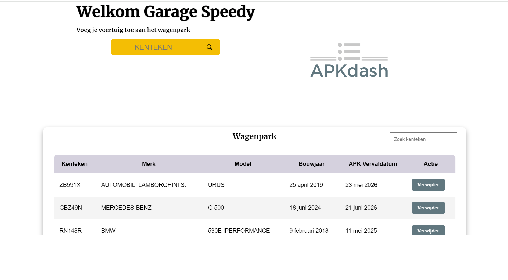

# APKdash

## Inhoudsopgave

- [Inleiding](#item-one)
- [Benodigdheden](#item-two)
- [De applicatie draaien](#item-three)
- [Testaccount](#item-four)

<a id="item-one"></a>

## Inleiding

Met APKdash kan je voortaan op een snelle en overzichtelijke manier jouw voertuigadministratie bijhouden. Het rijden met
een verlopen APK levert een boete op van 169 euro. Met deze applicatie heb je de uiterlijke keurdata van jouw wagenpark
overal beschikbaar en zijn boetes verleden tijd. Als ingelogde gebruiker kan je op basis van het ingevoerde kenteken de
volgende
voertuiggegevens ophalen: merk, model, bouwjaar en APK-vervaldatum. De gegevens kan je makkelijk in een tabel weergeven.
De voertuiggegevens zijn betrouwbaar omdat ze afkomstig zijn van de RDW (Rijksdienst voor het Wegverkeer).



<a id="item-two"></a>

## Benodigdheden

APKdash draait op React versie 18 en maakt daarnaast gebruik van een aantal 'dependencies' zoals Axios, voor het
binnenhalen van API-data. De jwt-decode is een handige tool voor het ontcijferen van de JWT-token. De applicatie draait
op twee externe informatiebronnen. De eerste informatiebron is de database met gebruikers en de tweede informatiebron is
de database met voertuiggegevens van Nederland. Voor het werkend krijgen van de applicatie moet er een env. bestand
aangemaakt worden en dit bestand moet gevuld worden met de variabel-namen zoals beschreven in env.dist. map. Na het
aanmaken van de API keys moet er een build gedraaid worden door de commando npm run build in de terminal te runnen. 

Hieronder staan de twee API keys van bovenstaande informatiebronnen:                   
VITE_API_KEY=apkdash:FvHuI1XWwbfWXBseFvR8
VITE_RDW_KEY=2ORnyM5ZifXL8QrSXOUaq3nUV

<a id="item-three"></a>
## De applicatie draaien

Door het project te clonen vanuit mijn Github pagina krijg je een identieke versie op jouw eigen computer. Je kan het
project dan bekijken en naar eigen inzicht aanpassingen toevoegen. Het project kan je vinden
op https://github.com/AyoubNL/Eindopdracht-Frontend installeer eerst de `node_modules` door het volgende
commando in de terminal te runnen:

```
npm install
```

Wanneer dit klaar is, kun je de applicatie starten met behulp van:

```
npm run dev
```

of gebruik de WebStorm knop (npm start). Open [http://localhost:3000](http://localhost:3000/) om de pagina in de browser
te bekijken.


<a id="item-four"></a>
## Testaccount

Garage Speedy   
Welkom2024!


